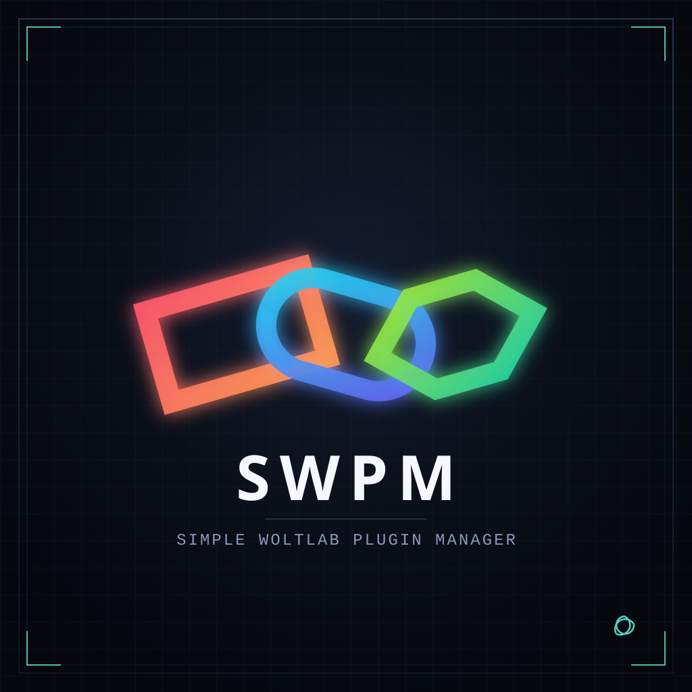

<p align="center">
  
</p>

<h1 align="center">Simple WoltLab Plugin Manager</h1>

<p align="center">
  <strong>CLI-Workbench für WoltLab-Plugins — Build, Validierung und Release im Terminal.</strong>
</p>

<p align="center">
  <a href="https://github.com/benjarogit/simple-woltlab-plugin-manager/releases/latest"></a>
  <a href="https://benjarogit.github.io/simple-woltlab-plugin-manager/"></a>
  <a href="https://github.com/benjarogit/simple-woltlab-plugin-manager/blob/main/LICENSE"></a>
</p>

<p align="center">
  
  
  
  <a href="https://github.com/benjarogit/simple-woltlab-plugin-manager/actions/workflows/tools-tests.yml"></a>
</p>

<p align="center"><a href="README.md"><strong>English version</strong></a></p>

---

## Dokumentation (Handbuch)

Alles Wichtige steht im **Online-Handbuch** — Navigation, Suche, Deutsch und Englisch. Die README hier ist nur der Einstieg.

**→ [SWPM Dokumentation](https://benjarogit.github.io/simple-woltlab-plugin-manager/)**

Quelle im Repo: `tools/docs/` (wird bei Push auf `main` automatisch nach GitHub Pages gebaut).

---

## Was ist SWPM?

Generisches Toolkit für WoltLab-Suite-Plugins: Paket schnüren (`package.xml`), Checks laufen lassen, Store-Regeln und Übersetzungen prüfen — im Terminal-Menü, ohne Bindung an ein bestimmtes Produkt-Plugin. Orientiert an den [WoltLab Plugin-Store-Richtlinien](https://www.woltlab.com/pluginstore/de/richtlinien/).

Gebaut für agenten-gestützte Abläufe mit Bodenhaftung: klares CLI, lokale Checks und Doku, die Tools ansteuern können — **vibe coding friendly**, weiterhin store-tauglich.

Kurzüberblick:

- Interaktives Menü: `./tools.sh`
- Build → installierbare `.tar.gz` (patch/minor/major/same)
- Validierung (PHP/XML, Templates, Sprachen, Store-Heuristiken)
- Optional: Produktlinie (Basis + Add-ons), TypeScript, PHPStan, Docker-Helfer für ACP

Details und Guides: **[Handbuch](https://benjarogit.github.io/simple-woltlab-plugin-manager/)**.

---

## Schnellstart

```bash
git clone https://github.com/benjarogit/simple-woltlab-plugin-manager.git
cd simple-woltlab-plugin-manager
./tools.sh
```

Windows ohne Unix-Shell: `tools.cmd`. Optional: `./tools.sh setup` und `tools/.env` aus `.env.example`.

Häufige Befehle: `./tools.sh build` · `./tools.sh validate …` · `./tools.sh help`  
CLI-Details: [tools/README.de.md](tools/README.de.md)

---

## Mitwirken & Lizenz

Beiträge willkommen — SWPM bleibt **generisch** (keine Produkt-Hardcodierung). Siehe [CONTRIBUTING.de.md](CONTRIBUTING.de.md).

**[MIT-Lizenz](LICENSE)** · [Changelog](CHANGELOG.md) · [Releases](https://github.com/benjarogit/simple-woltlab-plugin-manager/releases/latest)
