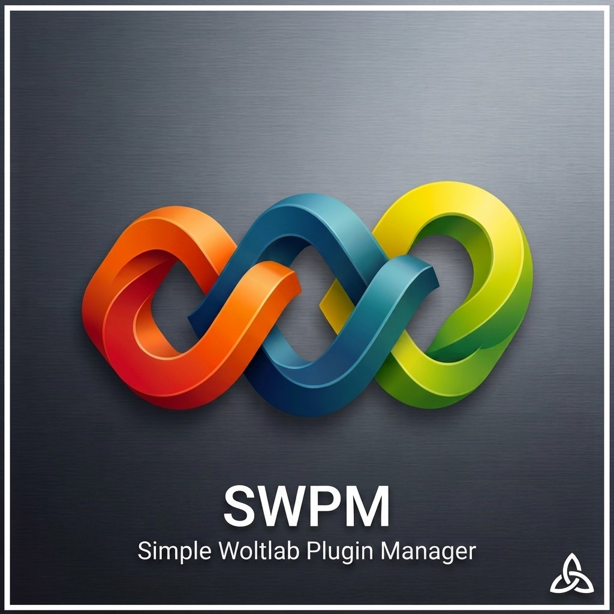

<p align="center">
  
</p>

<h1 align="center">Simple WoltLab Plugin Manager</h1>

<p align="center">
  <strong>Cross-platform CLI workbench for WoltLab plugins — built from real plugin work, with checks and validation in the terminal.</strong>
</p>

<p align="center">
  <a href="https://github.com/benjarogit/simple-woltlab-plugin-manager/releases/latest"></a>
  <a href="https://github.com/benjarogit/simple-woltlab-plugin-manager/blob/main/LICENSE"></a>
  
  
</p>

<p align="center">
  
  
  
  
  
</p>

<p align="center"><a href="README.de.md"><strong>Deutsche Version</strong></a></p>

---

## About the project

**SWPM** comes from day-to-day work: building WoltLab Suite plugins means repeating the same steps — packaging (`package.xml`), running checks, watching store rules and translations. SWPM puts that workflow into one terminal menu so you can stay focused on the plugin.

Today it is a **generic** CLI toolkit for setup, build, validation, and GitHub release — not tied to a single product plugin. It stays aligned with the official [WoltLab Plugin Store guidelines](https://www.woltlab.com/pluginstore/en/guidelines/).

---

## Features

- **Interactive menu** — `./tools.sh` for build, validate, TypeScript, Git push, and setup.
- **Package build** — Creates installable `.tar.gz` archives with patch/minor/major/same versioning; [source layouts](tools/docs/PACKAGE-LAYOUT.en.md) (`files/`, `files_wcf/`, `templates/`, style packages as `style.tar`/`style.tgz`, `--json` for CI).
- **Product line** — Optional core + add-ons via `swpm-family.json` (`family:build` / `family:validate`); see [PRODUCT-LINE.en.md](tools/docs/PRODUCT-LINE.en.md).
- **Validation** — PHP/XML, XSS/SQL heuristics, DE/EN language keys, PIP sources, store checklist; TypeScript check when sources exist; optional PHPStan (`phpstan.neon`) and `./tools.sh lint:python` (ruff).
- **Workspace setup** — Optional: WoltLab Core, official docs, WCF source, and [WoltLab d.ts](https://github.com/WoltLab/d.ts) typings.
- **Release workflow** — Commit, push, tag, and GitHub release via `gitpush.sh`.
- **Cross-platform** — Linux, macOS, Windows (WSL2 or Git Bash); on Windows use `tools.cmd`.
- **Optional Docker helpers** — Local ACP install and permission fixes; **core tools run without Docker**.

---

## Tech stack

| Layer | Technology |
|-------|------------|
| Entry & orchestration | Bash (`tools.sh`, `tools/*.sh`) |
| Validation & checks | Python 3 (`check-*.py`, `validate-plugin.sh`) |
| Plugin assets (optional) | Node.js / TypeScript in your plugin project |
| Packaging | `tar`, `package.xml`, WoltLab PIP archives |
| Local test (optional) | Docker, DDEV |

Core tools run with **Bash + Git + tar**. Python 3 is strongly recommended for validation.

---

## Installation

### Prerequisites

| Requirement | Required | Notes |
|-------------|----------|-------|
| Bash | Yes | WSL2 or [Git for Windows](https://git-scm.com/download/win) on Windows |
| Git | Yes | Clone and release workflow |
| tar | Yes | Package archives |
| Python 3 | Recommended | Validation scripts |
| Node.js | Optional | Only if your plugin uses TypeScript |

### Steps

**1. Clone the repository**

```bash
git clone https://github.com/benjarogit/simple-woltlab-plugin-manager.git
cd simple-woltlab-plugin-manager
```

**2. Start the toolkit**

```bash
./tools.sh
```

On Windows without a Unix shell:

```cmd
tools.cmd
```

**3. (Recommended) Run setup when you need Core, docs, or typings**

```bash
./tools.sh setup
```

**4. Configure local paths (optional)**

```bash
cp tools/.env.example tools/.env
# Edit tools/.env — WoltLab path, GIT_REPO_URL, etc.
```

Place your plugin in a folder with `package.xml` (e.g. `basis-plugin/`) or unpack an existing package into `temp_edit/`.

---

## Usage

### Interactive menu

```bash
./tools.sh
```

Example menu (abbreviated):

```text
╔══════════════════════════════════════════════════════════╗
║              Simple WoltLab Plugin Manager               ║
╚══════════════════════════════════════════════════════════╝

  Plugins
  ✓ My Plugin    v1.0.0 [basis-plugin]

  ENTWICKLUNG
  1   Build / Update-Paket
  2   TypeScript
  3   Unpack
  F   Product line
  4   Plugin validieren
  …
```

### Common commands

```bash
# Build with patch version bump
./tools.sh build

# Build without changing version (development)
./tools.sh build:same

# Validate before store submission
./tools.sh validate basis-plugin

# Product line (core + add-ons)
./tools.sh family:check
./tools.sh family:build patch

# TypeScript compile
./tools.sh typescript

# Optional: PHPStan (needs phpstan.neon) / ruff for manager Python
./tools.sh phpstan basis-plugin
./tools.sh lint:python

# Commit, push, GitHub release
./tools.sh push

# CLI overview
./tools.sh help
```

### CI-friendly build (JSON report)

```bash
./tools/build.sh --json patch
```

### Workspace layout

| Folder | Purpose |
|--------|---------|
| `basis-plugin/` | Your main plugin (example name) |
| `tools/` | All scripts |
| `woltlab-core/` | Core files after setup |
| `woltlab-d-ts/` | TypeScript typings after setup |

**Plugin source layout:** Put frontend templates in `templates/` (they become `templates.tar`). ACP templates stay in `acptemplates/`. PIP XMLs such as `option.xml` and `page.xml` remain in the package root. Root-level `*.tpl` still packs, but you get a warning; use `--strict-layout` or `validate-plugin.sh --strict` to fail instead. Style packages: sources under `style/` → archive name from `package.xml`. Details: [PACKAGE-LAYOUT.en.md](tools/docs/PACKAGE-LAYOUT.en.md).

Full tools reference: **[tools/README.md](tools/README.md)** · Guides index: **[tools/docs/README.md](tools/docs/README.md)**

---

## Contributing

Contributions are welcome. SWPM is a **generic** toolkit — do not add hardcoded paths or scripts for a single product plugin.

1. Fork the repository and create a feature branch.
2. Keep changes focused; match existing Bash/Python style.
3. Update **English and German** docs when you change user-facing behavior.
4. Open a pull request with a clear description of what and why.

Details: **[CONTRIBUTING.md](CONTRIBUTING.md)** (DE: [CONTRIBUTING.de.md](CONTRIBUTING.de.md))

---

## License

This project is licensed under the **[MIT License](LICENSE)**.

You may use, modify, and distribute SWPM freely. Keep the copyright notice intact. Contributions are appreciated; passing the work off as your own proprietary product without attribution is not the intent of this license.

---

## Links

- [Latest release](https://github.com/benjarogit/simple-woltlab-plugin-manager/releases/latest)
- [Changelog](CHANGELOG.md)
- [WoltLab Suite Download](https://www.woltlab.com/en/woltlab-suite-download/)
- [WoltLab Plugin Store Guidelines](https://www.woltlab.com/pluginstore/en/guidelines/)
